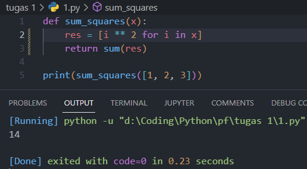
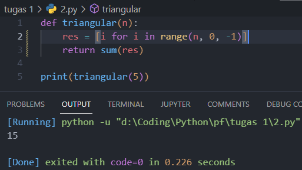
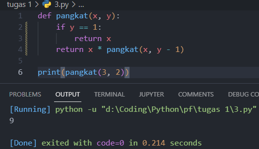

## Minggu 1
Nomor | Hasil
------|------
1     | 
2     | 
3     | 
4     | 
5     |  Yang dipelajari dari tugas ini adalah untuk membuat suatu fungsi python yang dapat mengembalikan hasil sesuai dengan yang diinginkan, cara menggunakan list comprehension dan fungsi rekursif dan cara pembalikan suatu string