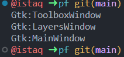
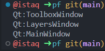
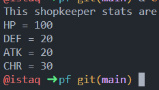
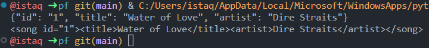
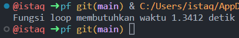
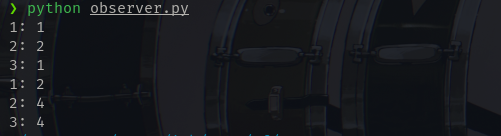
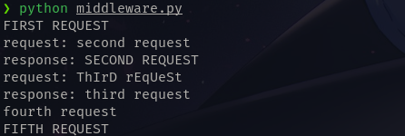
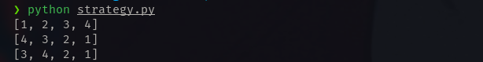

## Tugas Kelompok

# Anggota Kelompok
1. Istaqom Wirawan Adi Pratama (11201043)
2. Muhammad Fathurrohim (11201061)
3. Muhammad Miftahul Asyhar (11201064)
4. Putri Qonita Arif (11201076)

# Creational
Method | Hasil
------|------
Abstract Factory     | 
Prototype     | 
Factory     | 

# Structural
Method | Hasil
------|------
Decorator     | 
Proxy     | 
<!-- 3     |  -->

# Behavioral
Method | Hasil
------|------
Observer     | 
Chain-of-Responsibility     | 
Strategy     | 